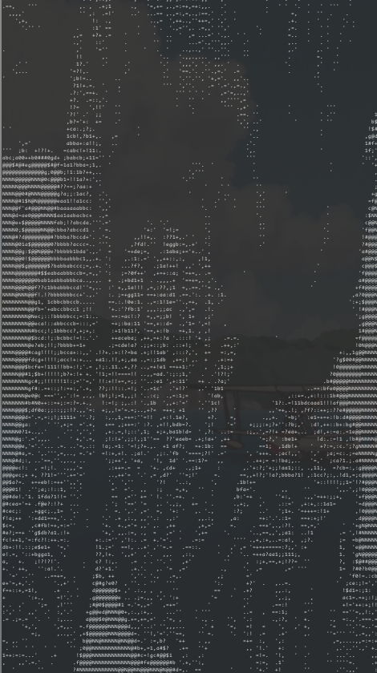

# asC - ASCII Image Converter

**asC** is a tool that converts any supported image format into an ASCII art representation. 
This tool is perfect for generating text-based images from any of the supported formats.

## Features

- **Convert images to ASCII art**: Transform any image into an ASCII version with customizable scaling and optional color inversion.
- **Support for multiple image formats**: asC supports a multiple image formats, making it versatile for different use cases.

## Supported File Formats

asC supports the following image file formats:

1. **JPEG (.jpg, .jpeg)**
2. **PNG (.png)**
3. **BMP (.bmp)**
4. **PNM (.ppm, .pgm)**
5. **PSD (.psd)**
6. **TGA (.tga)**
7. **HDR (.hdr)**
8. **PIC (.pic)**

## Usage

To use asC, run the following command in your terminal:

```bash
asc [options] <image_file>
```

### Options

- `-p, --path <image_file>`: Specify the path to the image you want to convert.
- `-r, --resize <factor>`: Scale the output by the given factor. Values less than 1 are recommended for better readability.
- `-i, --invert`: Invert the image colors for better contrast in the ASCII output.
- `-h, --help`: Display help information.

## Example

Here’s a simple example of how to use asC:

```bash
asc -p guts_berserker_armor.jpg -r 0.5 -i > someFile.txt
```

In this example:
- The image located at `guts_berserker_armor.jpg` is converted to an ASCII representation and printed to the terminal.
- The output is scaled to 50% of the original size.
- The colors are inverted to improve visibility.
- <OPTIONAL> '>' puts the output of the terminal to a file.  


## Installation

To install asC, clone the repository and compile the source code:

```bash
git clone https://github.com/yourusername/asc.git
cd asc
make
```

## License

This project is licensed under the GPL License.


## Improvement 

I am planning on improving this with the following features:
- video support
- GIF support
- edge detection and styled representation

## Gallery

<p float="left">
  
  
  
  
</p>

<table>
  <tr>
    <td></td>
    <td></td>
  </tr>
  <tr>
    <td></td>
    <td></td>
  </tr>
</table>
